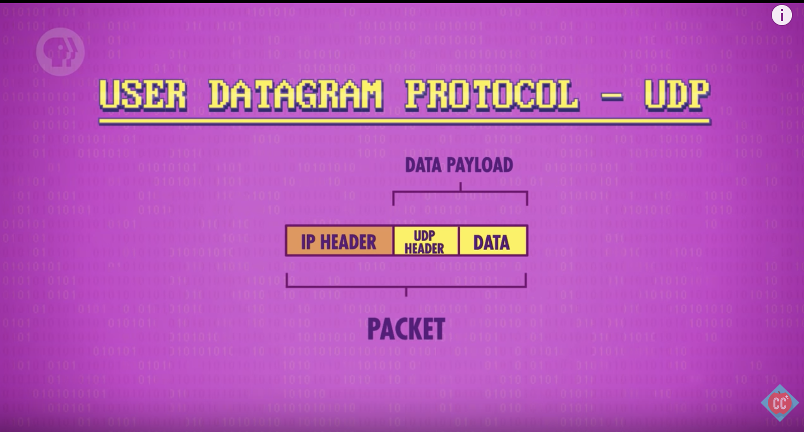
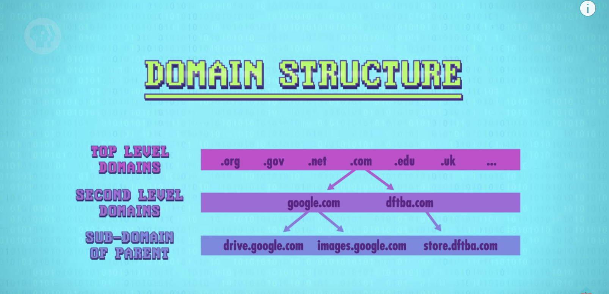

## The Internet

- LAN -> WAN (run by ISP)
- An IP will contain the IP Header (metadata on where to send the packet) and data payload, the actual data.

- UDP (User Datagram Protocol)

  - Has it own header.
  - Inside this header, it will have a port number. Every application will have its own port number once installed. When a packet arrives to the computer, the OS will look inside its header and deliver it to the application with the corresponding port number.
  - UDP will have a checksum to verify the data has correctly come in.
  - No mechanism to fix the data or request a new copy when corrupted
  - IP -> Gets the packet to the right computer
  - UDP -> Gets the packet to the right application
  - Good for applications that want something simple and fast

- TCP (Transmission Control Protocol)

  - Also contains a port number and checksum
  - Packets given sequential numbers, allowing them to be put in order
  - Sends back a 'ack' to the sending computer to verify the packets got to the requesting computer
  - Can retransmit if the sender doesn't respond
  - TCP/IP will double the number of packets being send (compared to UDP)

- DNS

  - When your computer requests a webpage, it needs access to the IP address and Port number
    

- OSI Model
  - Physical layer (e.g. electrical signals, radio signals), Data link layer (e.g. mac addresses), Network layer (e.g. switching), Transport layer (e.g. protocols), Session layer (e.g. opening ports)
    
